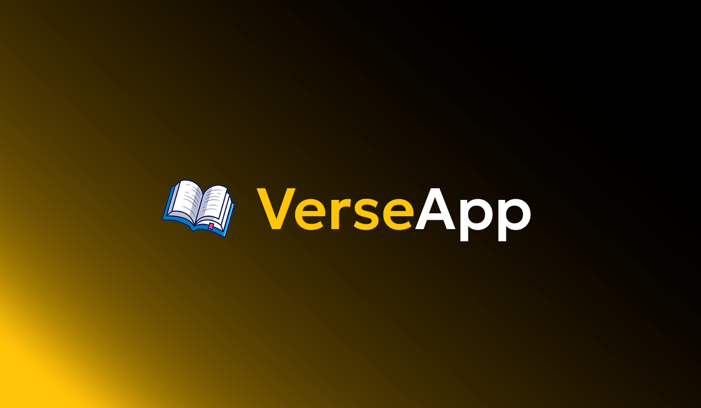

# 📖 VerseApp V2


## ✨ Features

- 🔎 Seleção de **Livro, Capítulo e Versículo** em comboboxes elegantes
- ❤️ Sistema de favoritos com localStorage e página dedicada (React Router)
- ⚡ Carregamento rápido usando um **JSON local** da Bíblia, sem depender de API externa
- 🎨 Interface moderna com **Tailwind CSS v4**, fonte personalizada e scrollbar customizada
- 🔁 Comboboxes em cascata (Livro → Capítulo → Versículo), com estados desabilitados inteligentes
- 📱 Layout responsivo, otimizado para desktop e mobile
- 🌗 Estilo focado em leitura confortável (background escuro, contraste bom)

---

## 🧱 Stack Tecnológica

- **Frontend:** React 19 + Vite 7
- **Roteamento:** React Router v7
- **Estado Global:** Context API + localStorage
- **Estilização:** Tailwind CSS v4 + tailwind-scrollbar
- **Componentes de UI:** Headless UI (`Combobox`), Heroicons, Lucide Icons
- **Dados:** `biblia.json` local (Almeida)
- **Dev Experience:** ESLint, Hot Module Replacement (HMR)

---

## 🚀 Como rodar o projeto

```bash
# 1. Clonar o repositório
git clone https://github.com/Augustbr01/VerseAppV2.git
cd VerseAppV2

# 2. Instalar dependências
npm install

# 3. Rodar em ambiente de desenvolvimento
npm run dev
```

O Vite geralmente sobe em `http://localhost:5173`.  

O comando já está configurado com `--host` no `package.json` e exibirá o IP da rede local.

---

## 🧩 Estrutura de Pastas

```text
  public/
  ├── biblia.json    # Base de dados local da Bíblia (Almeida)
  │
  src/
  ├── assets/
  │   └── logo.png        # Logo do VerseApp
  │
  ├── components/
  │   ├── BibliaSearch/
  │   │   ├── BibliaSearch.jsx  # Orquestra busca + exibição de resultados
  │   │   ├── ResultDisplay.jsx     # Exibe versículo único ou capítulo completo
  │   │   └── SearchForm.jsx    # Formulário com selects de Livro/Cap/Versículo
  │   │
  │   ├── subcomponents/
  │   │   ├── FavoriteButton.jsx   # Botão de coração para favoritar versículos
  │   │   ├── SelectCap.jsx        # Combobox de capítulos
  │   │   ├── SelectLivro.jsx      # Combobox de livros
  │   │   └── SelectVerse.jsx      # Combobox de versículos
  │   │
  │   ├── Favoritos.jsx         # Página de versículos favoritos
  │   ├── Navbar.jsx            # Barra de navegação (Buscar/Favoritos)
  │   └── Search.jsx            # Container da página de busca (com efeitos visuais)
  │
  ├── contexts/
  │   └── FavoritosContext.jsx  # Context API para gerenciar favoritos (localStorage)
  │
  ├── hooks/
  │   └── useBiblia.js          # Hook customizado para lógica de busca na Bíblia
  │
  ├── App.jsx                   # Configuração de rotas (React Router) + Provider global
  ├── index.css                 # Tailwind + estilos globais (fontes, scrollbar customizada)
  └── main.jsx                  # Entrada da aplicação React + BrowserRouter

```

---

## 🎛 Detalhes de Implementação

### Arquitetura de Dados
- JSON da Bíblia carregado via hook useBiblia (useEffect + fetch)
- Derivação de listas: livros únicos → capítulos → versículos
- Dados cacheados em estado para performance

### Fluxo de Busca
- Seleção: Livro / Capítulo / Versículo → Botão buscar
- Resultado exibido em ResultDisplay com animação slide-in-from-top
- Opção "Ver capítulo completo" com scroll automático
- Botão de favorito (coração) em cada versículo

### Favoritos
- Context API + localStorage para persistência
- Toggle funciona em qualquer página (busca/favoritos)
- Estrutura: { id, livro, capitulo, versiculo, texto, dataAdicionado }

### Navegação
- React Router v6: / (busca) e /favoritos
- NavLink com highlight automático da página ativa

### UI/UX
- Gradiente circular interativo seguindo cursor (pageX/pageY)
- Scrollbar customizada (.scrollbar-custom)
- Design responsivo mobile-first com Tailwind


## 📦 Versão Anterior (V1)

A primeira versão do VerseApp, feita em **HTML + CSS + JavaScript vanilla**, continua disponível em:

👉 [VerseApp V1](https://github.com/Augustbr01/VerseApp)

Este repositório (V2) é uma reescrita completa com foco em arquitetura e boas práticas modernas de frontend.

---

## 📄 Licença

Este projeto é open source e está sob a licença MIT.

---

## 👨‍💻 Autor

**Augusto Corrêa**  
Estudante de Engenharia de Software 
[GitHub](https://github.com/Augustbr01) | [LinkedIn](https://www.linkedin.com/in/augusto-corr%C3%AAa-6537a8276/)
